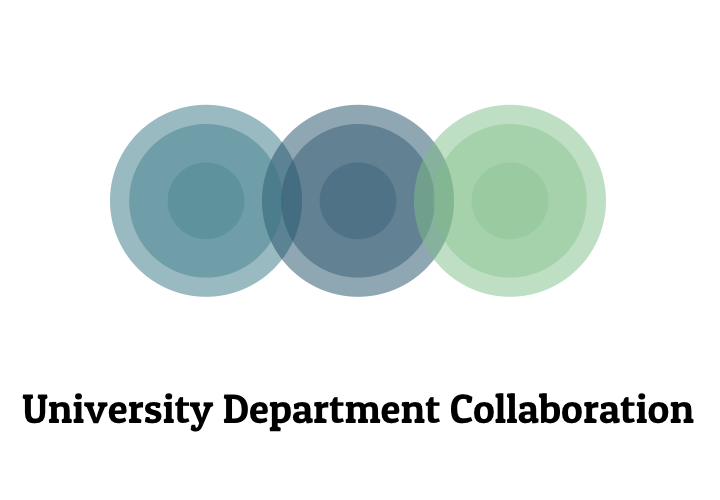

# Unit Collaboration
This repository provides an exploration on the collaboration between univeristy departments in two Saudi universities and international university. This work focuses on King Fahd University of Petroleum and Minerals and compare it with King Saud University as a local comparsion and MIT as an international comparsion. The collaboration is measured based on the collaboratin between authors in all publications that was published during 2018 - 2020. 

In this Repo you will find the following:
1. Data files related to each university. 
2. The code that joins the different files extracted from Web of Scince WoS and joins it in one csv file. 
3. Author Extraction from the data. 
4. Disambiguation of author names. 
5. Data Normalizaion. 
5. Visulization.
